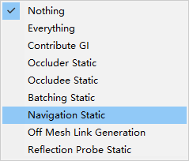
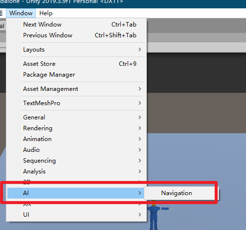
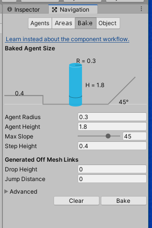
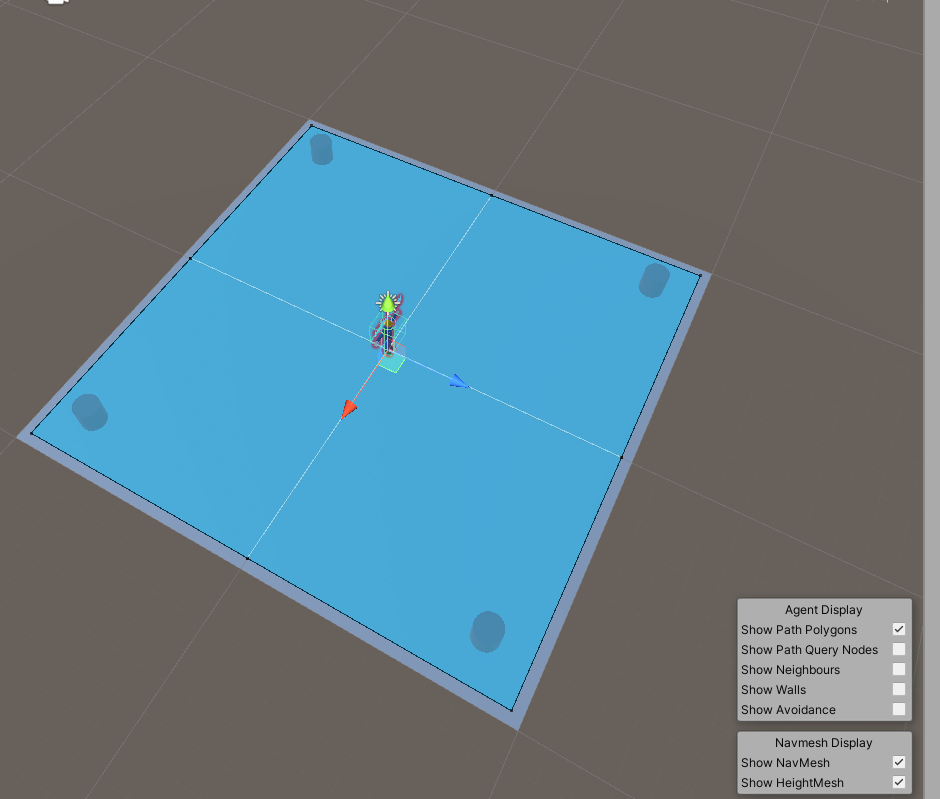

## 描述

做的自动寻路的功能	

## 使用方法

### 地形烘焙

我这里粗略讲解,详细的自己在网上学习一下

把场景中的地形和物体的navigation static勾选上



打开navigation



选中bake选项卡,并调节参数,然后点击bake



就可以在场景中看到地面上有个蓝色的地形



### 插件使用

把player_worker拖入场景中,

插件写在x_NavPlayer上

接口为

```csharp
public void SetTargetPosition(Vector3 _v3TargetPosition)
```

x_GroundClick

为demo演示脚本,实际根据自己的喜好来做